# The Superposition and Coin Analogy: Phase and Interference on Real Quantum Hardware

A quantum computing project that builds physical intuition for **superposition, measurement basis, quantum phase, and interference** by comparing a qubit to a classical coin, then breaking that analogy apart using real experiments run on **real IBM Quantum hardware** (Qiskit).

---

## Table of Contents

1. [Project Overview](#project-overview)
2. [Theoretical Background](#theoretical-background)
3. [Environment & Setup](#environment--setup)
4. [Part 1: The Classical Coin vs. The Quantum Coin](#part-1-the-classical-coin-vs-the-quantum-coin)
5. [Part 2: Running the Quantum Coin on Real Quantum Hardware](#part-2-running-the-quantum-coin-on-real-quantum-hardware)
6. [Part 3: Superposition in Three Dimensions](#part-3-superposition-in-three-dimensions)
7. [Part 4: Quantum Phase — The Hidden Dimension of Superposition](#part-4-quantum-phase--the-hidden-dimension-of-superposition)
8. [Part 5: A Better Analogy — The √NOT Gate](#part-5-a-better-analogy--the-not-gate)
9. [Part 6: Visualizing Gates on the Bloch Sphere](#part-6-visualizing-gates-on-the-bloch-sphere)
10. [Results Summary](#results-summary)
11. [Conclusion](#conclusion)
12. [Merits](#merits)
13. [Limitations](#limitations)
14. [Tech Stack](#tech-stack)
15. [How to Run](#how-to-run)

---

## Project Overview

Superposition is usually the very first concept taught in quantum computing and also one of the easiest to misunderstand. This project uses a **classical coin flip as an analogy** for a qubit's superposition, then systematically tests where that analogy holds and where it breaks down, using experiments executed on **real IBM quantum processors**.

The project explores:
- Why a qubit in superposition is not "randomly flipping" like a coin in the air.
- How measurement basis changes what "superposition" even means.
- What quantum **phase** is, and how it drives constructive or destructive **interference**.
- Why the "coin standing on its edge" (√NOT gate) is a more accurate analogy than a coin flip.
- How every single-qubit gate used here corresponds to a deterministic rotation on the **Bloch sphere**.

## Theoretical Background

A qubit's state is not a single statevector, it can be a **superposition** of two or more basis statevectors. For basis states $|0\rangle$ and $|1\rangle$, an arbitrary qubit state is:

$$|\psi\rangle = a|0\rangle + b|1\rangle$$

This is analogous to a classical bit, which can only be 0 or 1. But a qubit can also exist in superposition of both. More generally, the superposition principle states that any linear combination of valid physical states is itself a valid physical state, and the squared magnitude of each amplitude gives the probability of measuring that outcome.

## Environment & Setup

The project environment uses the following packages:

| Package | Minimum Version |
|---|---|
| `qiskit` | 2.1.0+ |
| `qiskit-ibm-runtime` | 0.40.1+ |
| `qiskit-aer` | 0.17.0+ |
| `qiskit.visualization` | — |
| `numpy` | — |
| `pylatexenc` | — |

```bash
pip install qiskit qiskit-ibm-runtime qiskit-aer
pip install pylatexenc numpy
```

IBM Quantum hardware access is handled through `QiskitRuntimeService`, using the least-busy available real backend (`service.least_busy(operational=True, simulator=False)`) rather than a simulator. So all measurement statistics in this project reflect **real hardware noise**, not idealized simulation.

## Part 1: The Classical Coin vs. The Quantum Coin

A classical coin flip has a 50% chance of landing heads up or down:

$$S(coin) = \frac{1}{2}|up\rangle + \frac{1}{2}|down\rangle$$

Flipping a simulated classical coin 1000 times gives the expected near-even split:

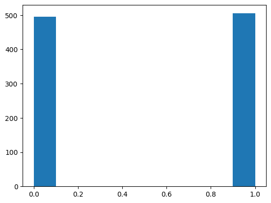

A **quantum coin** is created by starting a qubit at $|0\rangle$ and applying a Hadamard gate, placing it into equal superposition:

$$|\psi\rangle = \frac{1}{\sqrt{2}}|0\rangle + \frac{1}{\sqrt{2}}|1\rangle$$

```
Circuit: H → Measure
```

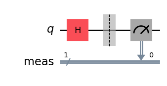

Unlike the classical coin, the quantum coin's coefficients are **complex probability amplitudes**, not probabilities themselves. Its probability come from the squared magnitude of each amplitude.

## Part 2: Running the Quantum Coin on Real Quantum Hardware

The Hadamard circuit above was transpiled for the least-busy real IBM backend and executed with the `SamplerV2` primitive over 1000 shots. The resulting histogram from **actual quantum hardware**:

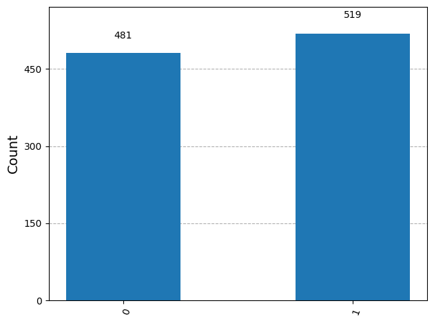

At 1000 samples, the quantum coin's measurement statistics are statistically indistinguishable from the classical coin flip. At this stage, the analogy still holds.

## Part 3: Superposition in Three Dimensions

The analogy is pushed further by measuring the quantum coin along a different axis (X, using the `Estimator` primitive instead of `Sampler`), rather than the standard Z-basis. For an equal superposition state, a classical coin analogy would predict an expectation value of 0 along any axis.

Instead, measuring $H|0\rangle$ along X gives an **expectation value of +1** — i.e., a 100% probability of measuring $|+\rangle$ and 0% probability of $|-\rangle$. This is the first clear break from the classical coin analogy: **a state can be random in one measurement basis and completely deterministic or definite in another measurement basis.**

## Part 4: Quantum Phase: The Hidden Dimension of Superposition

Classical probabilistic coefficients are real, positive numbers. Quantum amplitudes are **complex numbers** with both a magnitude and a **phase** $\phi$:

$$c_i = |c_i|e^{i\phi_i}$$

Phase determines how amplitudes interfere i.e. constructively (in phase) or destructively (out of phase). This is demonstrated by applying a Hadamard gate **twice**, which classically would be meaningless, but quantum mechanically uses interference to deterministically return the qubit to its starting state:

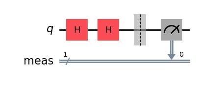

Executed on real hardware, the qubit reliably collapses back to $|0\rangle$, confirming destructive interference of the $|1\rangle$ component and constructive interference of the $|0\rangle$ component:

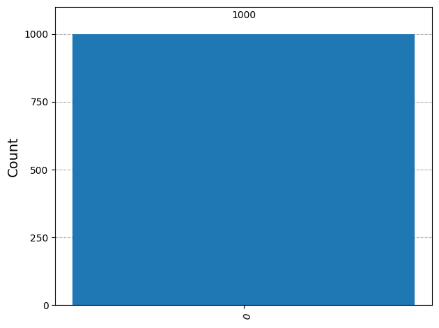

To demonstrate phase's effect directly, a **PHASE gate** ($\phi = \pi$) is inserted between the two Hadamard gates:

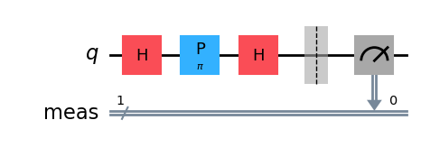

This flips the interference pattern entirely. The qubit now reliably collapses to $|1\rangle$ instead of $|0\rangle$, proving that a hidden phase can completely change the outcome of later operations:

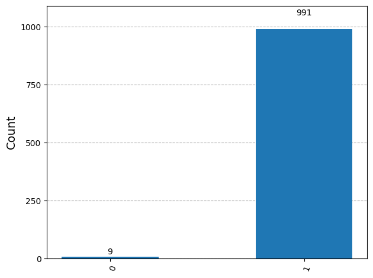

## Part 5: A Better Analogy: The √NOT Gate

A classical NOT gate flips a coin 180°. The **√NOT (square-root-of-NOT) gate** is its quantum analogue at only a 90° rotation. It is conceptually like a coin balanced on its edge such that it neither heads down nor heads up, and collapsing unpredictably to either side upon measurement.

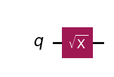

Measuring the resulting state along X, Y, and Z using the `Estimator` primitive on real hardware gives expectation values of **0, −1, 0** respectively which means that there is 50/50 randomness along X and Z, but a fully deterministic result along Y. This "coin on its edge" is a more accurate physical analogy for superposition than a coin simply flipping in the air, since it reproduces the same "randomness in one basis, definite in another" behavior seen with the Hadamard gate.

## Part 6: Visualizing Gates on the Bloch Sphere

Every single-qubit gate used in this project can be understood as a deterministic rotation of a vector called Bloch vector on the **Bloch sphere**:

| Gate | Rotation |
|---|---|
| NOT (X) | 180° around the X-axis |
| √NOT (SX) | 90° around the X-axis |
| PHASE(φ) | φ around the Z-axis |
| Hadamard (H) | 90° around Y-axis, then 180° around X-axis |

**1. NOT gate:**

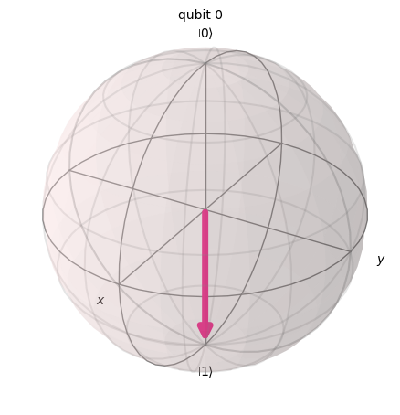

**2. √NOT gate:**

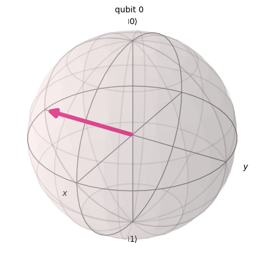

**3. PHASE gate (φ = π):**

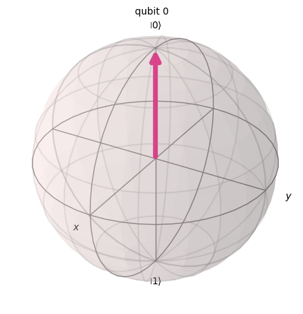

**4. Hadamard gate:**

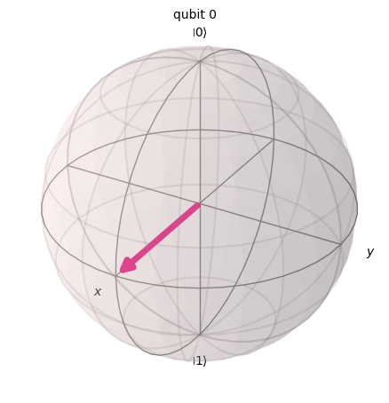

These visualizations confirm that none of the gate operations are random. Infact, the randomness in this entire project comes **only from the act of measurement**, never from the gate operations themselves.

## Results Summary

| Experiment | Real Hardware Result | Interpretation |
|---|---|---|
| Classical coin (1000 flips) | ~50/50 split | Baseline probabilistic reference |
| Quantum coin, Z-basis (H + measure) | ~50/50 split | Matches classical coin at this stage |
| Quantum coin, X-basis (Estimator) | ⟨X⟩ = +1 (100% \|+⟩) | Random in Z, deterministic in X — breaks the coin analogy |
| Double Hadamard (H·H) | Collapses to \|0⟩ | Destructive/constructive interference restores original state |
| Hadamard–Phase(π)–Hadamard | Collapses to \|1⟩ | Hidden phase flips the interference outcome entirely |
| √NOT gate (⟨X⟩, ⟨Y⟩, ⟨Z⟩) | 0, −1, 0 | "Coin on its edge" — random in X/Z, definite in Y |

## Conclusion

- Measuring a quantum superposition state is **not** equivalent to flipping a classical coin because both these are initially look identical, but diverge as soon as the measurement basis is changed.
- A qubit in superposition can be visualized as a 3D **Bloch vector** pointing in a definite direction; superposition is **basis-dependent** — a state can be a superposition in one basis while being definite in another.
- All quantum gate operations are **deterministic and reversible** rotations of Bloch vector. The randomness enters the system **only at measurement**.
- The Bloch vector is a visualization/calculation tool for measurement probabilities. It does not describe what the quantum state is "really doing" prior to measurement.

> Superposition is basis-dependent, quantum evolution is deterministic, and measurement produces the exact randomness.

## Merits

- Uses **real IBM Quantum hardware** for every measurement rather than relying solely on idealized simulators, so results include genuine hardware noise and real-world quantum behavior.
- Builds concepts progressively i.e. coin analogy → basis dependence → phase → interference → Bloch sphere, rather than presenting them in isolation.
- Pairs every theoretical claim with a matching circuit, execution, and visualized result, making the physics verifiable rather than purely descriptive.
- Explicitly identifies where the coin analogy **breaks down**, which is often skipped in introductory materials and is key to avoiding common misconceptions about superposition.
- Environment setup, circuits, execution, and analysis are all in a single reproducible notebook.

## Limitations

- Restricted to a **single qubit**; does not explore entanglement, multi-qubit interference, or larger circuits.
- Real-hardware runs are subject to queue times and backend availability (`least_busy` backend), so exact noise characteristics will vary between runs and are not directly reproducible run-to-run.
- The coin analogy, while pedagogically useful, is explicitly acknowledged as breaking down for describing the qubit's state *before* measurement i.e. it is a tool for building early intuition, not a complete physical model.
- IBM Quantum API token has intentionally been removed from the notebook for security, so hardware-execution cells require the user's own credentials to re-run.

## Tech Stack

- **Language:** Python
- **Quantum SDK:** [Qiskit](https://www.ibm.com/quantum/qiskit), Qiskit IBM Runtime, Qiskit Aer
- **Hardware:** Real IBM Quantum backend (via `QiskitRuntimeService`)
- **Visualization:** Qiskit Visualization (circuit diagrams, histograms, Bloch sphere), Matplotlib
- **Other:** NumPy, pylatexenc

## How to Run

1. Clone this repository and open `Superposition.ipynb` in Jupyter or Google Colab.
2. Install dependencies:
   ```bash
   pip install qiskit qiskit-ibm-runtime qiskit-aer pylatexenc numpy
   ```
3. Create a free [IBM Quantum Platform](https://quantum.ibm.com/) account and generate an API token.
4. Replace the placeholder token in the `QiskitRuntimeService.save_account(...)` cell with your own token.
5. Run all cells sequentially. Hardware-execution cells will queue for the least-busy available real backend.

---
